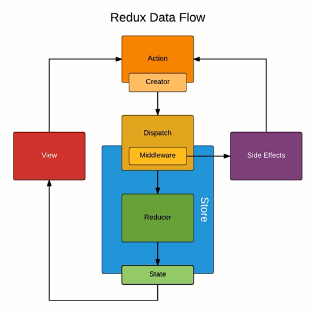

# redux-advanced
以 **[UI-Container](../UI-Container/)** 为蓝本。<br>
使用 redux-thunk中间对异步进行代码的编写<br>
使用了 `antd、axios、redux、redux-thunk`<br>
```
yarn add antd
yarn add redux
yarn add axios
yarn add redux-thunk
```
## Redux-thunk
使用 redux-thunk中间件实现 ajax数据请求
1. 在 [store](store/index.js) 中在创建 `store` 的时候使用中间件 `redux-thunk`
2. 将异步发送数据的操作从 [组件](TodoList.js) 提取到 [action](store/actionCreators.js) 中

redux-thunk中间件是对 Dispatch进行升级<br>
