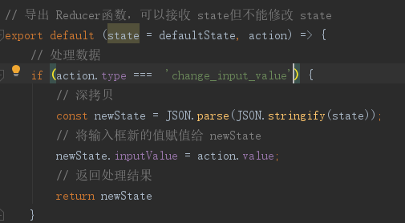
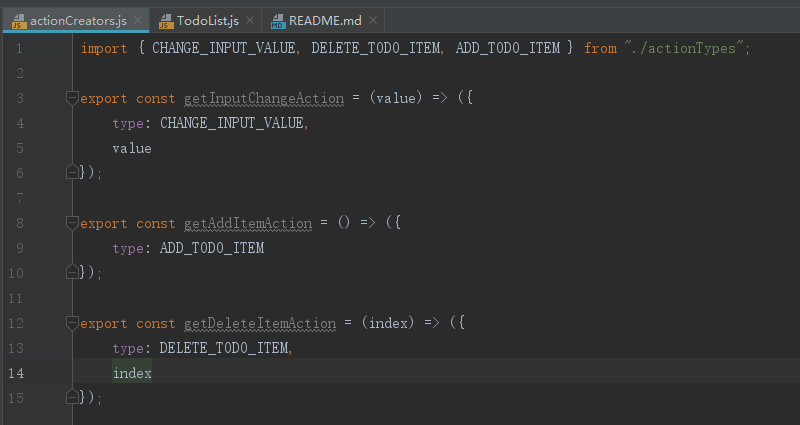

# React
使用 antd框架 
功能点击提交按钮将输入框数据加载到下方，点击数据则删除 
安装 antd: `yarn add antd` 
安装 redux: `yarn add redux` 
## antd
1. 引入样式: `import 'antd/dist/antd.css';`
2. 引入组件: `import {Input, Button} from 'antd';`
## Redux

1. Store用于保存数据。依赖 Reducers。自定义 store路径: `src/store/index.js`
    1. 导入 createStore: `import { createStore } from 'redux';`
    2. 导入 reducer:  *自定义的*  `reducer.js`
2. Reducers是函数用于管理数据(处理、存储)。自定义 Reducers路径: `src/store/reducer.js`
    1. 默认 state
    2. 返回的对象后，store将更换 state为返回的 reducer返回的对象
3. React Components组件。路径: `src/TodoList.js`
    1. 导入 store:  *自定义的*  `store.js`
    2. 当 store改变时: `store.subscript(func)`
    3. 向 store传 action: `store.dispatch(aciton)` 
### ActionType的拆分
1. 就是将 `action` 对象的 `type` 提取出来，避免写错(写错会报异常) 
使用时需导入: `import { CHANGE_INPUT_VALUE, ADD_TODO_ITEM, DELETE_TODO_ITEM } from './store/actionTypes';`

2. 原先的(若是 type写错，不会报错但功能不能正常作用)
    1. action 
    
    2. reducer 
    
3. 后来的(若是 type写错，react会报错)
    1. action 
    
    2. reducer 
    
### ActionCreator
1. 就是将 `action` 对象的创建提取出来，方便自动化测试 
使用时需导入: `import { getAddItemAction, getDeleteItemAction, getInputChangeAction } from "./store/actionCreators";`

2. 原先的 action 

3. 后来的 action 

### Redux设计和使用的三项原则
1. store是唯一的
2. 只有 store能改变自己的内容
3. Reducer必须是纯函数
